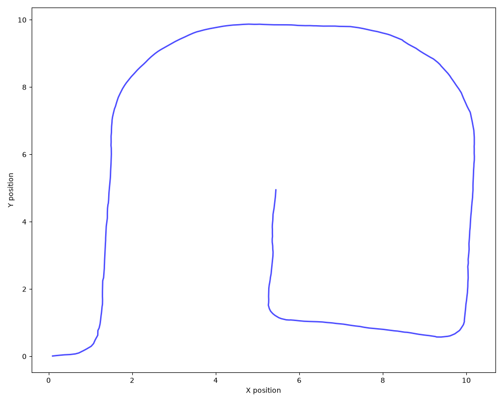

# FastSLAM для мобильного робота

Требуется реализовать алгоритм **FastSLAM** для решения задачи **SLAM** (одновременной локализации и картографирования) при движении мобильного робота в помещении, карта которого задана конечным набором ориентиров.

## 1. Модель движения (Odometry Motion Model)
Положение мобильного робота в момент времени $t$ определяется вектором состояния $(x_t, y_t, \theta_t)^T$, где $(x_t, y_t)$ — декартовы координаты на плоскости, а $\theta_t$ — ориентация робота. 

Движение описывается следующей моделью с учетом зашумленной одометрии:
$$x_t = x_{t-1} + \hat{\delta}_t \cos(\theta_{t-1} + \hat{\delta}_{r1})$$
$$y_t = y_{t-1} + \hat{\delta}_t \sin(\theta_{t-1} + \hat{\delta}_{r1})$$
$$\theta_t = \theta_{t-1} + \hat{\delta}_{r1} + \hat{\delta}_{r2}$$

Компоненты зашумленного управляющего воздействия рассчитываются как:
$$\hat{\delta}_{r1} = \delta_{r1} + \epsilon_{\alpha_1 |\delta_{r1}| + \alpha_2 \delta_t}$$
$$\hat{\delta}_t = \delta_t + \epsilon_{\alpha_3 \delta_t + \alpha_4 (|\delta_{r1}| + |\delta_{r2}|)}$$
$$\hat{\delta}_{r2} = \delta_{r2} + \epsilon_{\alpha_1 |\delta_{r2}| + \alpha_2 \delta_t}$$

Где:
* $(\delta_{r1}, \delta_t, \delta_{r2})$ — заданные управляющие воздействия (данные одометрии) из файла `sensor_data.dat`.
* $\epsilon_{\sigma^2}$ — центрированная нормальная случайная величина с дисперсией $\sigma^2$.
* Коэффициенты шума: $[\alpha_1, \alpha_2, \alpha_3, \alpha_4] = [0.1, 0.1, 0.05, 0.05]$.

## 2. Модель наблюдений (Measurement Model)
При движении робот в каждый момент времени регистрирует несколько ориентиров (landmarks), определяя расстояние и направление до каждого из них с помощью лазерного дальномера. Информация о наблюдениях представлена в файле `sensor_data.dat`.

Матрица ковариаций аддитивной шумовой компоненты модели наблюдения имеет вид:
$$Q_t = \begin{pmatrix} 1 & 0 \\ 0 & 0.01 \end{pmatrix}$$

## 3. Результат
