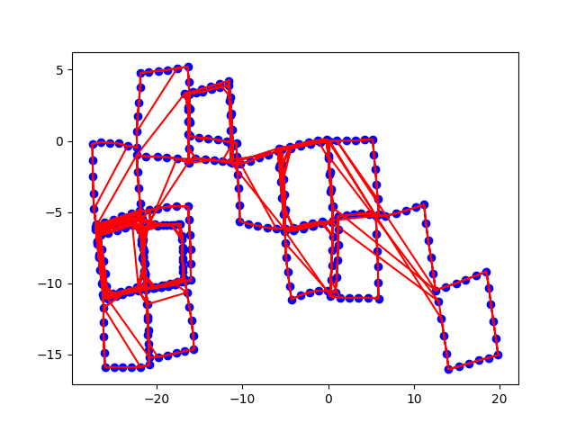
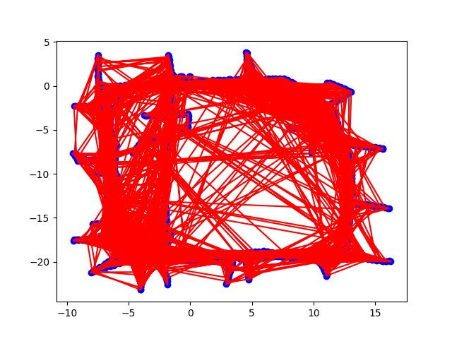
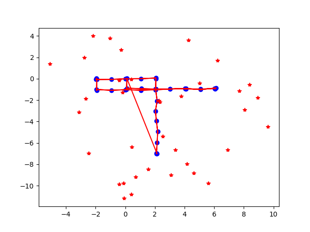
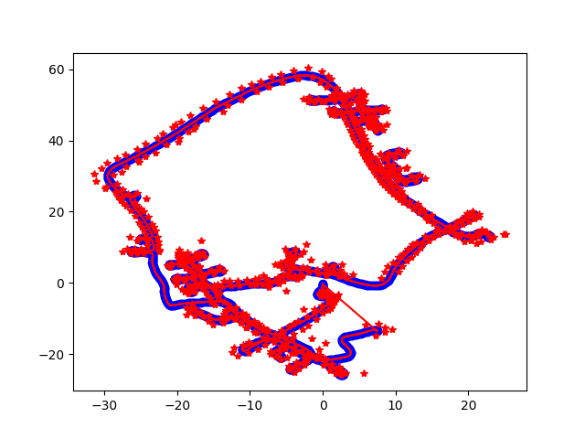

# 2D Graph-Based SLAM с использованием метода наименьших квадратов

В данном репозитории представлена реализация нелинейного метода наименьших квадратов для решения задачи **Graph-based SLAM** (оптимизации графа поз). Вектор состояния включает в себя как 2D-позы робота $(x, y, \theta)^T$, так и 2D-координаты ориентиров $(x_l, y_l)^T$.

---

## Описание проекта

Задача SLAM сформулирована в виде графа (хранящегося в формате `.g2o`), где:
* **Узлы (Vertices):** Представляют собой неизвестные переменные, которые необходимо оптимизировать.
  * `VERTEX_SE2`: 2D-позы робота.
  * `VERTEX_XY`: 2D-координаты ориентиров.
* **Ребра (Edges):** Представляют собой ограничения (критерии ошибки), полученные из измерений датчиков.
  * `EDGE_SE2`: Ограничения типа «поза-поза» (одометрия или сопоставление сканов).
  * `EDGE_SE2_XY`: Ограничения типа «поза-ориентир» (расстояние и азимут до ориентира).

Алгоритм итеративно линеаризует эти ограничения, строит разреженную линейную систему ($H\,\Delta x = -b$) и обновляет вектор состояний до момента сходимости.

---

## Математическая формулировка

### 1. Функции ошибки
**Ограничение «Поза-Поза» ($e_{ij}$):**
  
  $$e_{ij}(x_i, x_j) = \begin{pmatrix} R_{ij}^T (R_i^T (t_j - t_i) - t_{ij}) \\ \theta_j - \theta_i - \theta_{ij} \end{pmatrix}$$
  
**Ограничение «Поза-Ориентир» ($e_{il}$):**

  $$e_{il}(x_i, x_l) = R_i^T (x_l - t_i) - z_{il}$$

### 2. Якобианы (Матрицы производных)

Якобианы функций ошибки по состояниям узлов рассчитываются следующим образом:

**Для ограничений Поза-Поза:**

$$
A_{ij} = \frac{\partial e_{ij}}{\partial x_i} = \begin{pmatrix} -R_{ij}^T R_i^T & R_{ij}^T \frac{\partial R_i^T}{\partial \theta_i} (t_j - t_i) \\ \mathbf{0}^T & -1 \end{pmatrix}, \quad B_{ij} = \frac{\partial e_{ij}}{\partial x_j} = \begin{pmatrix} R_{ij}^T R_i^T & \mathbf{0} \\ \mathbf{0}^T & 1 \end{pmatrix}
$$

**Для ограничений Поза-Ориентир:**

$$
A_{il} = \frac{\partial e_{il}}{\partial x_i} = \begin{pmatrix} -R_i^T & \frac{\partial R_i^T}{\partial \theta_i}(x_l - t_i) \end{pmatrix}, \quad B_{il} = \frac{\partial e_{il}}{\partial x_l} = R_i^T
$$

---

## Оцениваемые датасеты и ожидаемые результаты

Работа алгоритма проверяется на четырех эталонных наборах данных (как синтетических, так и реальных). 

| Название датасета | Описание | Начальная ошибка | Конечная ошибка после сходимости |
| :--- | :--- | :--- | :--- |
| **`simulation-pose-pose.g2o`** | Синтетическая траектория, только ограничения «поза-поза» | ~138 862 234 | **~8 269** |
| **`intel.g2o`** | Реальные данные (Исследовательский центр Intel), только позы | ~1 795 139 | **~360** |
| **`simulation-pose-landmark.g2o`** | Синтетическая траектория с картой ориентиров | ~3 030 | **~474** |
| **`dlr.g2o`** | Реальные данные (DLR датасет) с ориентирами | ~369 655 336 | **~56 860** |

---

## Результаты

Ниже представлены результаты пошаговой оптимизации, визуализирующие выравнивание графа на каждой итерации алгоритма.

### 1. Simulation (Pose-Pose)

### 2. Intel Dataset (Реальные позы)

### 3. Simulation (Pose-Landmark)

### 4. DLR Dataset (Реальные ориентиры)

