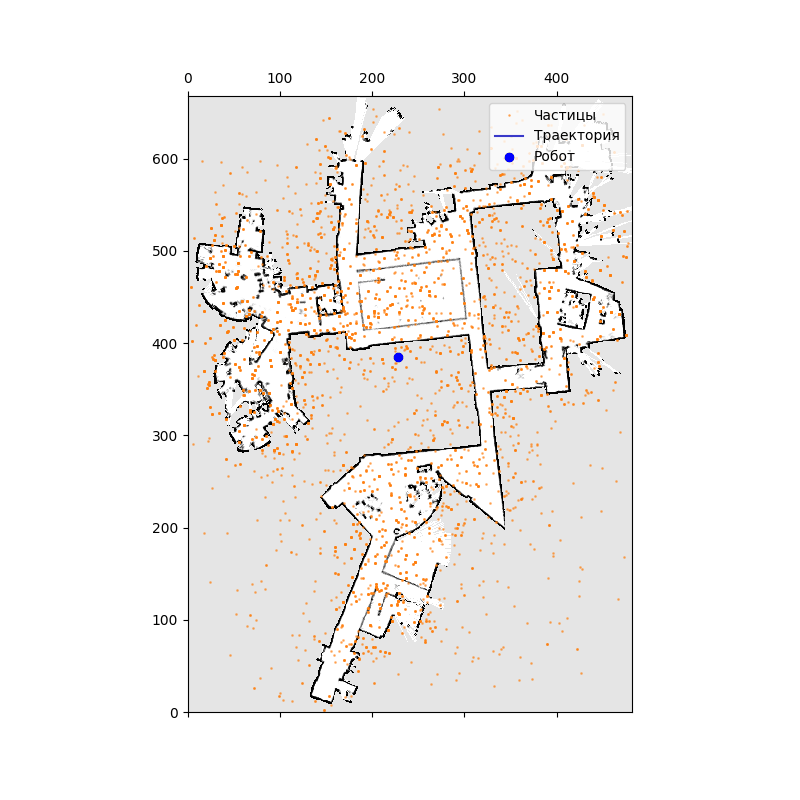

# Локализация мобильного робота с помощью фильтра частиц (Monte Carlo Localization)

Реализация алгоритма **локализации робота методом Монте-Карло (MCL)** при известной карте помещения на основе показаний одометрии и измерений расстояния с помощью лазерного дальномера. Робот движется на плоскости, его положение определяется вектором состояния $x_t = (x, y, \theta)^T$.

---

## Описание задачи

Цель работы — разработать фильтр частиц (Particle Filter) для удержания точной оценки положения робота в процессе движения по карте. 

### Используемый датасет (`dataset_mit_csail.p`) включает:
* **`img_map`** — дискретная карта помещения (массив ячеек).
* **`likelihood_map`** — предварительно рассчитанное поле правдоподобия для модели наблюдения.
* **`odom`** — показания одометрии ($\delta_{rot1}, \delta_{trans}, \delta_{rot2}$).
* **`z`** — измерения лазерного дальномера (37 лучей $\rho_i, \phi_i$ на каждом шаге).

---

## Математическая модель алгоритма

### 1. Модель движения (Odometry Motion Model)
На шаге прогноза положение каждой частицы обновляется с учетом шума одометрии:
$$\hat{\delta}_{rot1} = \delta_{rot1} - \mathcal{N}(0, \alpha_1 |\delta_{rot1}| + \alpha_2 \delta_{trans})$$
$$\hat{\delta}_{trans} = \delta_{trans} - \mathcal{N}(0, \alpha_3 \delta_{trans} + \alpha_4 (|\delta_{rot1}| + |\delta_{rot2}|))$$
$$\hat{\delta}_{rot2} = \delta_{rot2} - \mathcal{N}(0, \alpha_1 |\delta_{rot2}| + \alpha_2 \delta_{trans})$$

Новые координаты частицы рассчитываются как:
$$x_{new} = x + \hat{\delta}_{trans} \cos(\theta + \hat{\delta}_{rot1})$$
$$y_{new} = y + \hat{\delta}_{trans} \sin(\theta + \hat{\delta}_{rot1})$$
$$\theta_{new} = \theta + \hat{\delta}_{rot1} + \hat{\delta}_{rot2} \pmod{[-\pi, \pi]}$$

### 2. Расчет весов (Measurement Model)
Вес каждой частицы пропорционален правдоподобию лазерного скана в данной точке пространства:
$$w_{i,t} = \eta \prod_{j=1}^{K} p(z_{t}^j | x_{i,t})$$
Правдоподобие $p(z_{t}^j | x_{i,t})$ извлекается напрямую из **Поля правдоподобия (Likelihood Field)** по координатам конечных точек лазерных лучей.

### 3. Ресэмплинг (Low Variance Resampling)
Процедура систематического отбора частиц для исключения вырождения множества гипотез. Реализована на основе стохастического выбора (`np.random.choice`) с вероятностями, пропорциональными нормализованным весам частиц.

---

## Результаты локализации

Ниже представлена полная анимация процесса сходимости и удержания облака частиц вокруг истинной траектории робота на карте MIT CSAIL.

### Анимация работы фильтра частиц:

---

## Параметры запуска
* **Количество частиц ($N$):** 5000
* **Разрешение карты (resolution):** 0.1 м/пиксель
* **Коэффициенты шума одометрии ($\alpha$):** `[0.1, 0.1, 0.1, 0.1]`
