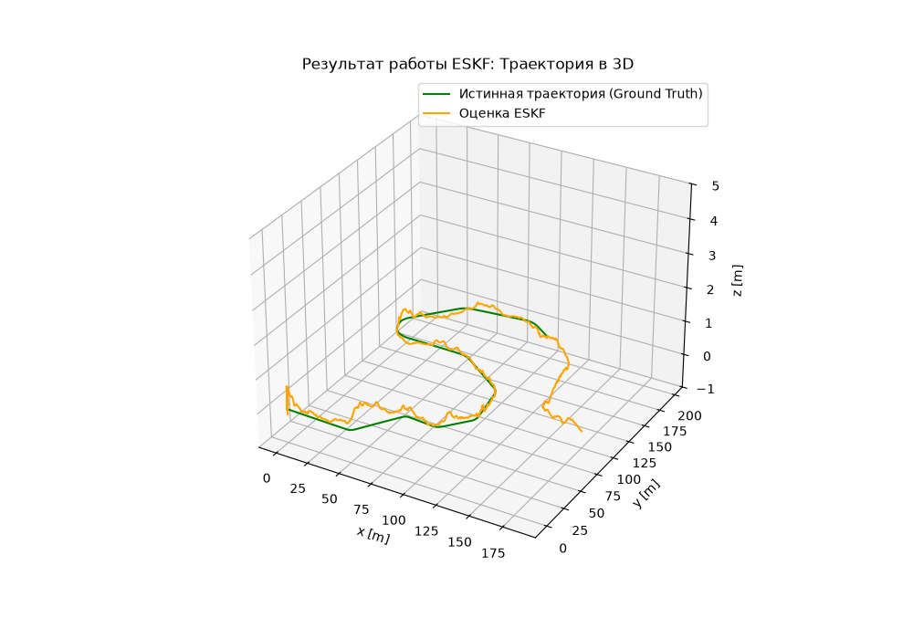

# Фильтрация Калмана в пространстве ошибок (ESKF) для 3D-навигации по данным IMU и GNSS/Лидар

## Постановка задачи
Решается задача оценивания 3D-траектории (положения, скорости и пространственной ориентации) мобильного объекта в трехмерном пространстве. Оценка строится на основе комплексирования высокочастотных зашумленных данных инерциального измерительного модуля (IMU) и низкочастотных корректирующих измерений глобальной навигационной системы (GNSS) и Лидара.

### Вектор истинного состояния системы
Состояние объекта описывается вектором $x = [p, v, q]^T$, где:
* $p \in \mathbb{R}^3$ — координаты положения в глобальной системе координат.
* $v \in \mathbb{R}^3$ — вектор линейной скорости в глобальной системе координат.
* $q$ — единичный кватернион, описывающий трехмерную пространственную ориентацию (переход из связанной системы координат в глобальную).

---

## Модель движения 

В каждый момент времени доступны измерения вектора ускорения $f_k$ и угловой скорости $\omega_k$, регистрируемые IMU в связанной с объектом системе координат (body frame). С учетом интервала дискретизации $\Delta t$, уравнения интеграции навигационных параметров имеют вид:

$$
\begin{aligned}
p_k &= p_{k-1} + \Delta t \cdot v_{k-1} + \frac{\Delta t^2}{2} (R(q_{k-1})f_{k-1} + g) \\
v_k &= v_{k-1} + \Delta t \cdot (R(q_{k-1})f_{k-1} + g) \\
q_k &= q_{k-1} \otimes q(\omega_{k-1}\Delta t)
\end{aligned}
$$

Где:
* $g = (0, 0, -9.81)^T$ — вектор ускорения свободного падения.
* $\otimes$ — операция кватернионного умножения.
* $R(q)$ — матрица поворота, соответствующая кватерниону $q$.
* $q(\theta) = \left( \cos\frac{|\theta|}{2}, \frac{\theta}{|\theta|}\sin\frac{|\theta|}{2} \right)$ — кватернион малого разворота.

---

## Математическая суть фильтрации в пространстве ошибок (ESKF)

Вместо фильтрации полного нелинейного состояния $x$, алгоритм ESKF оценивает вектор отклонений (ошибок) $\delta x_k = (\delta p_k, \delta v_k, \delta \theta_k)^T \in \mathbb{R}^9$, где $\delta \theta_k \in \mathbb{R}^3$ — вектор ошибки ориентации в глобальной рамке. 

Преимущество ESKF заключается в том, что пространство ошибок всегда близко к нулю, что делает линеаризацию уравнений исключительно точной и математически стабильной.

### Динамика пространства ошибок (Прогноз Калмана)
Уравнение распространения ошибки во времени описывается линейной системой:
$$\delta x_k = F_{k-1} \delta x_{k-1} + L_{k-1} n_{k-1}$$

Где матрицы Якобианов перехода состояний $F$ и шума $L$ имеют блочную структуру:

$$
F_{k-1} = \begin{pmatrix} 
I_{3\times3} & I_{3\times3}\Delta t & 0_{3\times3} \\ 
0_{3\times3} & I_{3\times3} & -[R(q_{k-1}) \cdot f_{k-1}]_\times \Delta t \\ 
0_{3\times3} & 0_{3\times3} & I_{3\times3} 
\end{pmatrix}, \quad 
L_{k-1} = \begin{pmatrix} 
0_{3\times3} & 0_{3\times3} \\ 
I_{3\times3} & 0_{3\times3} \\ 
0_{3\times3} & I_{3\times3} 
\end{pmatrix}
$$

* $[\cdot]_\times$ — кососимметричная матрица, задающая векторное произведение.
* $n_{k-1} \sim \mathcal{N}\left(0, \Delta t \left[ {\sigma^2_{acc}I \quad 0 \atop 0 \quad \sigma^2_{gyro}I} \right]\right)$ — вектор белого шума акселерометра и гироскопа.

---

## Модель внешних наблюдений (Коррекция Калмана)

Для коррекции накопившейся дрейфовой ошибки интеграции IMU используются внешние датчики положения (GNSS и Лидар), предоставляющие прямые аддитивные зашумленные измерения координат $p_k$:

$$
\begin{aligned}
Q_{GNSS} &= \sigma^2_{GNSS} I_{3\times3} \\
Q_{LIDAR} &= \sigma^2_{LIDAR} I_{3\times3}
\end{aligned}
$$

### Калибровка и преобразование данных Лидара
Перед подачей в фильтр, сырые пространственные измерения от Лидара переводятся из локальной системы координат в глобальную навигационную рамку с помощью матрицы жесткого трехмерного преобразования (поворот + перенос):

$$\text{lidar.data} = C \cdot \text{lidar.data} + t$$

Где константные параметры калибровки равны:

$$
C = \begin{pmatrix} 
0.99376 & -0.09722 & 0.05466 \\ 
0.09971 & 0.99401 & -0.04475 \\ 
-0.04998 & 0.04992 & 0.9975 
\end{pmatrix}, \quad 
t = \begin{pmatrix} 0.5 \\ 0.1 \\ 0.5 \end{pmatrix}
$$

---

## Структура входных данных
Алгоритм осуществляет чтение и разбор лога симуляции из файла `data/data.pkl`. В файле содержатся:
1. Высокочастотные метки времени и сырые показания IMU ($f_k, \omega_k$).
2. Асинхронные, приходящие с задержкой измерения GNSS и Лидара.
3. Массив `GroundTruth` (истинная траектория) для расчета метрик точности (RMSE) и финального сопоставления результатов фильтрации.

## Результат
