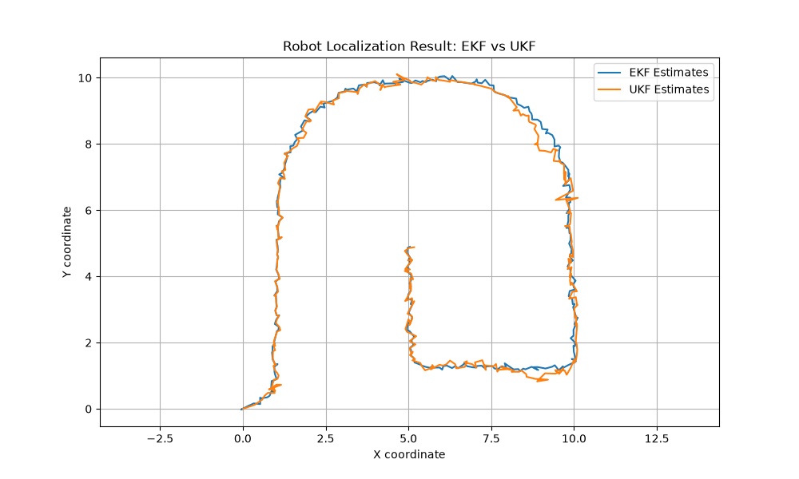

# Фильтрация Калмана для локализации мобильного робота по одометрии и ориентирам

## Постановка задачи
Решается задача отслеживания положения мобильного робота на плоскости в условиях, когда прямые измерения координат $(x, y)$ недоступны. Оценка состояния строится на основе относительных команд движения (одометрии) и дистанций до стационарных ориентиров с известными координатами.

* **Вектор состояния системы:** $x_t = [x_t, y_t, \theta_t]^T$, где:
  * $(x_t, y_t)$ — декартовы координаты робота на плоскости.
  * $\theta_t$ — угол ориентации (курс) робота.

---

## Модель движения (Odometry Motion Model)

Управление движением робота задается вектором $(\delta_{r1}, \delta_t, \delta_{r2})$, который считывается с одометров колес:
* $\delta_{r1}$ — начальный разворот робота на месте.
* $\delta_t$ — расстояние, пройденное по прямой (трансляция).
* $\delta_{r2}$ — финальный докрут ориентации.

Динамика изменения состояния описывается следующей нелинейной системой уравнений:

$$
\begin{aligned}
x_t &= x_{t-1} + \delta_t \cos(\theta_{t-1} + \delta_{r1}) + e_{x,t} \\
y_t &= y_{t-1} + \delta_t \sin(\theta_{t-1} + \delta_{r1}) + e_{y,t} \\
\theta_t &= \theta_{t-1} + \delta_{r1} + \delta_{r2} + e_{\theta,t}
\end{aligned}
$$

**Шум процесса (модели):** $e_{x,t}, e_{y,t}, e_{\theta,t} \sim \mathcal{N}(0, 0.2)$ — независимые гауссовские случайные величины с дисперсией $\sigma^2 = 0.2$, моделирующие проскальзывание колес и неровности поверхности.

---

## Модель наблюдений (Лазерный дальномер)

На карте расположены стационарные ориентиры (landmarks) с известными координатами $(m_{j,x}, m_{j,y})$. Робот оснащен лазерным дальномером, который на каждом шаге измеряет расстояние $z_{j,t}$ до доступных в данный момент ориентиров:

$$z_{j,t} = \sqrt{(m_{j,x} - x_t)^2 + (m_{j,y} - y_t)^2} + v_{j,t}$$

* **Шум измерений:** $v_{j,t} \sim \mathcal{N}(0, 0.2)$ — аддитивный белый гауссовский шум дальномера с дисперсией $\sigma^2 = 0.2$.
* Измерения до разных ориентиров в один и тот же момент времени считаются статистически независимыми.

---

## Структура входных данных
Алгоритм обрабатывает внешние файлы данных:
1. `landmarks.dat` — матрица точных координат всех доступных ориентиров на плоскости.
2. `sensor_data_ekf.dat` — последовательный лог симуляции. Каждая запись содержит управляющие команды одометрии $(\delta_{r1}, \delta_t, \delta_{r2})$, а также список идентификаторов замеченных ориентиров и измеренных до них расстояний.

---

## Реализация фильтрации
1. **Расширенный фильтр Калмана (Extended Kalman Filter — EKF):** 
   * **Прогноз:** Состояние пересчитывается напрямую по нелинейным уравнениям.
   * **Коррекция:** Для обновления ковариации ошибки $P_t$ модель наблюдения линеаризуется в окрестности текущей оценки с помощью вычисления Якобиана матрицы расстояний $H$.
2. **Сигма-точечный / Инвариантный фильтр Калмана (Unscented Kalman Filter — UKF):**
   * Вместо аналитического подсчета производных и Якобианов, алгоритм генерирует детерминированный набор сигма-точек вокруг текущей оценки, пропускает их через нелинейные уравнения движения/наблюдения и восстанавливает статистические моменты (среднее и ковариацию) с помощью взвешенного суммирования.

##  Результат
