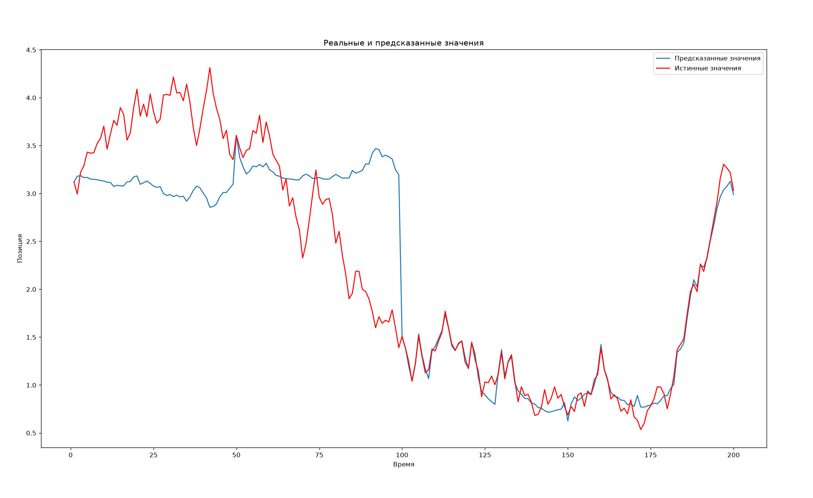

# Фильтр частиц для отслеживания мобильного объекта

## Постановка задачи
Требуется реализовать **фильтр частиц (Particle Filter)** для отслеживания положения мобильного объекта. 
* **Вектор состояния:** $x_k = [\theta(k), R]^T$, где $\theta(k)$ — угловое положение объекта, а $R$ — неизвестный радиус дуги контура.

### Модель движения
Объект движется по контуру, состоящему из дуги окружности неизвестного радиуса $R$ и вертикального сегмента, который определяется заданным углом $\bar{\theta} \in [0, \pi]$.

Положение объекта (угол $\theta(k)$) в момент времени $k$ задается следующим уравнением:

$$
\theta(k) = \begin{cases} 
\text{mod}(\theta(k - 1) + s(k - 1), 2\pi), & \theta(k - 1) ∈ (\bar{\theta}, 2\pi - \bar{\theta}) \\ 
\text{mod}\left(\theta(k - 1) + \frac{s(k-1)}{R+\bar{s}}, 2\pi\right), & \theta(k - 1) \in [0, \bar{\theta}] \cup [2\pi - \bar{\theta}, 2\pi) 
\end{cases}
$$

**Параметры и распределения:**
* Случайные величины $\{s(k)\}$ независимы и имеют равномерное распределение на отрезке $[-\bar{s}, \bar{s}]$.
* Радиус $R$ равномерно распределен на отрезке $[0, 2L]$, где $L$ — заданный параметр.
* Начальное распределение $\theta(0)$ — равномерное на отрезке $[0, 2\pi]$.

---

## Модель наблюдений

В каждый момент времени $k$ доступны измерения от двух датчиков:

### 1. Датчик горизонтального расстояния ($z_1$)
Сенсор расположен в точке $P$ на расстоянии $L$ от начала координат и измеряет горизонтальное расстояние $z_1(k)$ до объекта:

$$
z_1(k) = \begin{cases} 
L - R \cos\theta(k) + w(k), & \theta(k) \in (\bar{\theta}, 2\pi - \bar{\theta}) \\ 
L - R \cos\bar{\theta} + w(k), & \theta(k) \in [0, \bar{\theta}] \cup [2\pi - \bar{\theta}, 2\pi) 
\end{cases}
$$

* Где шум измерения $w(k) \sim \text{Tri}(\bar{w})$ имеет **треугольное распределение** с плотностью на отрезке $[-\bar{w}, \bar{w}]$.

### 2. Датчик полуплоскости ($z_2$)
В некоторые моменты времени доступно дискретное наблюдение, определяющее полуплоскость нахождения объекта:

$$
z_2(k) = \begin{cases} 
1, & \theta(k) \in [0, \pi) \\ 
-1, & \theta(k) \in [\pi, 2\pi) 
\end{cases}
$$

---

## Входные данные (`pf_data_pf.txt`)
В файле данных содержатся следующие переменные:
* `GroundTruth` — истинные значения положения $\theta(k)$ (использовать **только** для проверки и оценки ошибки алгоритма).
* `distanceSensor` — наблюдаемые значения горизонтального расстояния $z_1(k)$.
* `halfPlaneSensor` — наблюдаемые значения $z_2(k)$. Значение `NaN` означает, что в данный момент времени измерение отсутствует.

## Константные параметры для симуляции
При реализации алгоритма необходимо использовать следующие константы:
* $\bar{\theta} = \pi/3$
* $L = 2$
* $\bar{s} = 0.3$
* $\bar{w} = 0.1$

##  Результат
