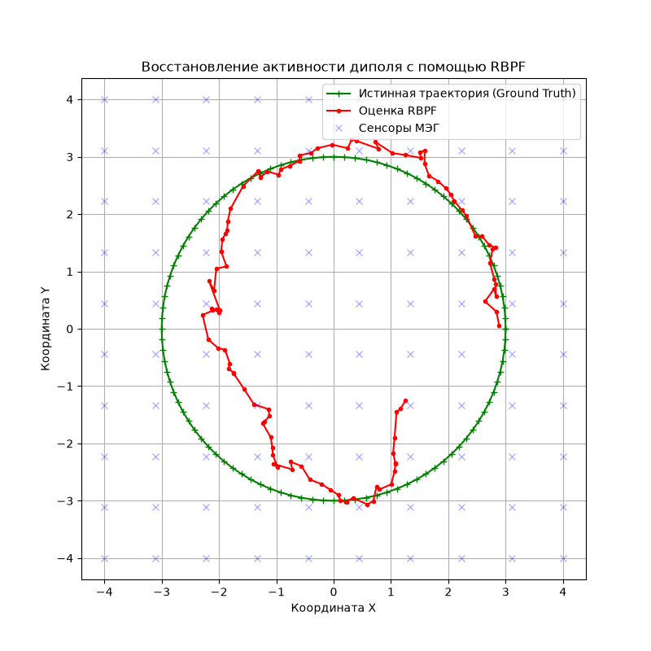

# Фильтрация частиц Рао-Блэквелла (RBPF) для дипольного моделирования активности головного мозга

## Постановка задачи
Решается обратная задача магнитоэнцефалографии (МЭГ) — неинвазивного метода исследования головного мозга. Задача заключается в восстановлении пространственного распределения активности нейронных источников на поверхности коры головного мозга по показаниям внешней системы датчиков.

Источники моделируются в виде перемещающегося электрического диполя в пределах плоскости $P = \{r = (r_1, r_2, 0)\}$. 
Система из $L$ сенсоров расположена на фиксированном удалении $h$ от этой плоскости.

### Вектор состояния системы
Состояние источника магнитного поля характеризуется 4 степенями свободы и описывается фазовым вектором $x_k = (p_k, q_k) \in \mathbb{R}^4$:
* $p_k = (p_1, p_2)$ — декартовы координаты положения диполя на плоскости.
* $q_k = (q_1, q_2)$ — координаты магнитного дипольного момента.

---

## Модель движения

Изменение фазового вектора диполя во времени описывается следующим дискретным разностным уравнением:
$$x_{k+1} = x_k + w_{k+1}$$

Где $w_{k+1}$ — центрированный гауссовский случайный вектор шума процесса (независимый от текущего состояния $x_k$) со следующей блочно-диагональной матрицей ковариаций $C$:
$$C = \text{diag}(\lambda^2, \lambda^2, \delta^2, \delta^2)$$

---

## Модель наблюдений (Закон Био-Савара-Лапласа)

Каждый из $L$ сенсоров регистрирует компоненту вектора магнитной индукции, перпендикулярную плоскости перемещения диполя $P$. 
Согласно закону Био-Савара-Лапласа, нелинейная функция наблюдения $b_j(x)$ для $j$-го сенсора, находящегося в точке $r_j$, имеет вид:

$$b_j(x_k) = \frac{\mu_0}{4\pi} \frac{e \cdot (q_k \times (r_j - p_k))}{|r_j - p_k|^3}, \quad j = 1, \dots, L$$

Где:
* $\mu_0$ — магнитная постоянная.
* $e$ — единичный вектор, перпендикулярный плоскости движения $P$.
* $p_k = (p_1, p_2, 0)^T$, $q_k = (q_1, q_2, 0)^T$.

Полный вектор наблюдений формируется как $b(x_k) = (b_1(x_k), \dots, b_L(x_k))^T$. Статистическая модель измерения имеет вид:
$$y_k = b(x_k) + V_k$$

Где $V_k \sim \mathcal{N}(0, \Gamma)$ — аддитивный гауссовский шум измерений с матрицей ковариаций $\Gamma$.

---

## Математическая суть алгоритма RBPF

Поскольку модель наблюдения является **нелинейной** относительно координат положения диполя $p$, но **строго линейной** относительно его магнитного момента $q_k$:
$$y_k = g(p_k)q_k + V_k$$

Для эффективного решения применяется **фильтрация частиц на основе теоремы Рао-Блэквелла (Rao-Blackwellized Particle Filter — RBPF)**. Этот подход позволяет снизить размерность пространства, в котором работает классический фильтр частиц, за счет аналитического разделения совместного распределения вероятностей:

$$\pi(p_k, q_k | y_{1:k}) = \pi(p_k | y_{1:k}) \cdot \pi(q_k | p_k, y_{1:k})$$

1. **Нелинейная часть $\pi(p_k | y_{1:k})$:** Траектория координат положения диполя ($p_1, p_2$) аппроксимируется с помощью стандартного **фильтра частиц (Particle Filter)**.
2. **Линейная часть $\pi(q_k | p_k, y_{1:k})$:** Координаты дипольного момента ($q_1, q_2$) для каждой частицы рассчитываются строго **аналитически с помощью линейного Фильтра Калмана**.

---

##  Результат

